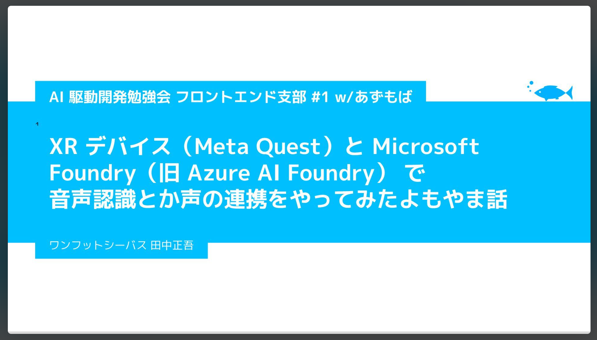

# AI 駆動開発勉強会 フロントエンド支部 #1 w/あずもば

このページは、わたくし田中正吾の AI 駆動開発勉強会 フロントエンド支部 #1 w/あずもば で登壇した資料置き場です。



<a href="https://speakerdeck.com/1ftseabass/2025-12-11-ai-driven-frontend-vol01" target="_blank">AI 駆動開発勉強会 フロントエンド支部 #1 w/あずもば - Speaker Deck</a>

# AI 議事録

AI 議事録ツール Rimo で起こしてもらった AI 議事録です。AI が聞き間違っていたり、まとめ間違っていたりしているかもしれない前提で、ご参考ください。

```


## 要約

- 田中正吾氏がMeta Quest 3とMicrosoft Foundry（旧Azure AI Foundry）を連携させた音声認識システムのライブデモを実施
- Azure AI FoundryがMicrosoft Foundryにリブランドされ、新旧UIが混在する移行期にあるが、APIキーでの接続は問題なく動作
- Whisper、GPT-4o、Text-to-Speechを統合したコンテナで、音声入力から応答までの一連のフローを実証
- XRデバイスは優れたノイズキャンセリング機能を持ち、音声入力デバイスとして有用
- AIエージェントフレームワーク「Mastra」やMCPにより、自然な会話の中でIoTデバイス制御やAPI実行が可能
- Microsoft Foundryは自組織のコンテナ内でデータ処理できるため、機密情報を扱う工場などでも安全にAI技術を活用可能
- 複数のAIモデルを選択・比較でき、最近のモデルは多数のツールを同時利用可能で複雑な会話フローに対応


<table-of-contents />


## 準備とセットアップ

- 田中正吾氏が登壇者として発表を開始し、機材の準備とセットアップを行った
- Meta Quest 3を使用したXRデバイスとMicrosoft Foundry（旧Azure AI Foundry）の音声認識と声の連携についてプレゼンテーションを実施
- プロジェクターやマイク、VRヘッドセットなどの機材接続を確認し、ミラーリング設定を完了
- ストップウォッチを起動し、約15分の発表時間を予定してスタート
- 個人事業主「一足シーバス」として2004年からフリーランス活動を行い、フラッシュ制作からウェブフロントエンドエンジニアへと活動領域を拡大してきた経歴を紹介


## Microsoft Foundryのリブランドと移行期の課題

- 最近Azure AI FoundryがMicrosoft Foundryにリブランドされ、開発環境が大きく変化していることを報告
- 新旧のユーザーインターフェースが混在しており、クラシックUIと新UIがトグルで切り替え可能な状態で、設定はそのままだが表示が異なる
- 旧式のエンドポイントはまだ使用可能だが、いつまで利用できるかは不明で、猶予期間が明確でない状態
- ヘルプドキュメントにもクラシック版と新版の情報が混在しており、情報の整理が追いついていない状況
- 新環境をクラウドで一から構築し、まっさらな状態から接続テストを実施する勇気ある挑戦を決行した


## Microsoft Foundryリソースの構築と設定

- 初期画面から推奨設定が表示され、以前のHub形式とは異なる新しいインターフェースに遭遇
- 旧UIを使用しながらも、Microsoft Foundryリソースとして従来と同じ役割で作成することに成功
- APIキーを使用した接続方式で問題なく動作することを確認
- 一つのコンテナ内に複数のAIモデルを配置できる構成を実現：質問応答用のGPT-4o、Text-to-Speech、文字起こし用のWhisperを統合
- Text-to-SpeechはOpenAIの本家版とは別のAPI構造になっているが、使用方法は類似しており扱いやすい設計


## ライブデモ：XRデバイスでの音声認識とAI応答

- Meta Quest 3を装着し、Unityアプリケーションを起動してライブデモを実施
- ボタンを押して録音開始・終了の操作を行い、「今日はファインディで登壇をしています。僕です」と発話
- Whisper APIが音声を正確にテキスト化し、「ファインディで登壇してる僕です」として認識
- GPT-4oが「それは素晴らしいですね。ファインディでの登壇、きっと素敵な経験になるでしょう。どんなテーマで話される予定ですか？また準備は順調ですか？応援しています」と応答
- Text-to-Speechの「ロイ」という日本語音声で流暢に音声再生され、システム全体が正常に動作することを実証
- 2回目のデモでは「なんとか登壇うまくいきました」が「東大になっちゃった」と誤認識される事例も発生し、発話者の滑舌の重要性を示した


## AIエージェントと音声インターフェースの可能性

- データを人間に伝えるフロントエンドの一側面として、音声インターフェースの重要性を強調
- AIエージェントとXRデバイスやIoTデバイスを組み合わせた音声認識システムの今後の発展性について考察
- TypeScriptでAIエージェントを構築できるオープンソースフレームワーク「Mastra」を紹介し、様々なAIモデルに接続しやすい抽象化の利点を説明
- 従来のスマートスピーカーはコールセンターのように流れが決まっているのに対し、AIエージェントは普通の会話と特定機能の実行を柔軟に切り替えられる
- MCP（Model Context Protocol）に代表されるように、会話の文脈に応じてLED制御などの物理デバイスを操作できる新しいインタラクションが可能になっている


## XRデバイスの技術的優位性とIoT統合

- Meta Quest 3などのXRデバイスは優れたノイズキャンセリング機能を搭載しており、音声入力デバイスとして非常に優れている
- Ray-Banスマートグラスなどの小型化されたデバイスや、さらに小型化されたIoTデバイスでの録音も今後期待される
- 工場などの局所最適環境で独自のAIエージェントを構築する際、既存デバイスのAIを使わず独自のシステムに接続できる柔軟性がある
- マイク入力から文字起こし、チャット経由で各種APIや制御システムにつなげるという新しいアーキテクチャの入口として大きな可能性を持つ
- データ取得APIや特定のIoT制御（LED点灯など）を、自然な会話の中で実行できる統合環境の構築が現実的になってきている


## Microsoft Foundryの利点とデータセキュリティ

- 様々なAIモデルを自由に選択して試せる環境が提供されており、それぞれのモデルの性能や得意分野を比較検証できる
- Azureのコンテナ内にOpenAI社のモデルやClaudeなどを配置でき、モデルの性能テストが容易に実施可能
- 情報の取り扱い面で大きな優位性：OpenAI社のAPIに直接データを送る場合と異なり、データのハンドリングを自分で制御できる
- IoTや工場の情報など、機密性の高いデータを扱う場合でも、自組織のコンテナ内で処理できるためデータ追跡性が高い
- 小規模工場などのセンシティブな情報を外部に送信するリスクを回避しながら、最新のAI技術を活用できる設計が可能


## API統合の進化と今後の展開

- 以前はPythonから細かく制御する必要があったが、最近はAPI環境が整備され、他デバイスとの連携が格段に容易になった
- 最近のパワフルなモデルは20個、30個のツールを同時に選択できるなど、トークン数の制約が緩和され、複雑な会話フローにも対応可能
- Microsoft FoundryとXRデバイスを連携させることで、AIエージェントとの統合に大きな可能性を感じている
- 自分でモデルを選択し、自分の環境で動かせることで、情報取り扱いの安心感と柔軟性が両立できる
- 今回の発表は途中経過の報告であり、今後もAIを絡めた様々な開発を継続していく予定である


```
